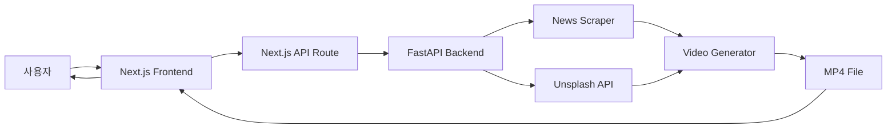

# ClipTheNews 주요 기능

## 🎬 영상 생성 기능

### 1. 자동 뉴스 스크래핑
- **OG 이미지 추출**: 메타 태그에서 대표 이미지 가져오기
- **본문 이미지 수집**: 기사 내 모든 이미지 탐색
- **다중 선택자 지원**: 다양한 뉴스 사이트 호환
  - 네이버뉴스, 조선일보, 중앙일보, 한겨레, 경향신문 등

### 2. 🆕 하이브리드 이미지 시스템 ⭐
**뉴스 이미지 + AI 스톡 이미지 조합**

```
뉴스에서 이미지 수집
    ↓
충분함? → YES → 바로 영상 생성
    ↓
   NO
    ↓
Unsplash API로 관련 이미지 자동 보충
    ↓
영상 생성
```

**장점:**
- ✅ 이미지가 없는 뉴스도 영상 생성 가능
- ✅ 더 다양하고 고품질 이미지 사용
- ✅ 제목 기반 스마트 키워드 매칭
- ✅ 완전 자동화 (사용자 개입 불필요)

**키워드 자동 매칭 예시:**
- "경제 성장률 상승" → Unsplash: "economy business"
- "스포츠 축구 경기" → Unsplash: "soccer football"
- "기술 혁신 발표" → Unsplash: "technology innovation"

### 3. 세로형 영상 생성 (9:16)
- **해상도**: 1080x1920 (Full HD)
- **길이**: 10초
- **프레임레이트**: 24 FPS
- **코덱**: H.264 (범용 호환)

### 4. 🆕 다이나믹 애니메이션 ✨
**정적 이미지를 역동적인 영상으로 변환**

- **줌인 효과**: 이미지가 천천히 확대 (1.0 → 1.1배)
- **줌아웃 효과**: 이미지가 천천히 축소 (1.1 → 1.0배)
- **교차 적용**: 짝수/홀수 이미지마다 번갈아 적용
- **부드러운 전환**: 10초 동안 자연스러운 움직임

**Before vs After:**
- ❌ Before: 정적 이미지만 표시 → 지루함
- ✅ After: 줌인/아웃 + 전환 효과 → 생동감

### 5. 🆕 Pillow 기반 자막 렌더링
**MoviePy의 TextClip 대신 안정적인 Pillow 사용**

**자막 구성:**
- **상단 제목**: 
  - 뉴스 제목 자동 추출
  - 큰 글씨 (55px)
  - 최대 2-3줄 자동 줄바꿈
  
- **하단 시나리오**:
  - 사용자 입력 텍스트
  - 중간 글씨 (50px)
  - 최대 3-4줄 자동 줄바꿈

**스타일:**
- 흰색 텍스트 + 검은 테두리 (3-4px)
- 어떤 배경에서도 명확하게 보임
- 맑은 고딕 폰트 우선 (한글 최적화)

### 6. 빠른 인코딩
- **Preset**: ultrafast
- **멀티스레딩**: 4 threads
- **평균 생성 시간**: 20-40초
- **최적화**: 이미지 2개로 제한

---

## 🎨 UI/UX 기능

### 랜딩 페이지
- **Hero 섹션**: 큰 헤드라인 + CTA 버튼
- **Features 섹션**: 3열 카드형 레이아웃
- **가격 비교**: 무료 vs 확장 기능 (미래)
- **반응형 디자인**: 모바일/태블릿/데스크톱 지원

### 영상 생성 페이지
- **URL 입력**: 자동 유효성 검사
- **시나리오 입력**: 
  - 실시간 글자 수 카운터 (0/300)
  - 자동 리사이즈 textarea
- **상태 관리**: 
  - 🔵 Idle: 입력 대기
  - 🟡 Loading: 생성 중 (진행률 바 표시)
  - 🟢 Success: 완료 (다운로드 버튼)
  - 🔴 Error: 실패 (에러 메시지)

### 로딩 UI
- **애니메이션**: 회전 스피너 + Ping 효과
- **진행 상태**: "뉴스 스크래핑 중...", "영상 생성 중..."
- **예상 시간**: "약 20-40초 소요"
- **진행률 바**: 시각적 피드백

---

## 🛠️ 기술적 특징

### Frontend (Next.js 14)
- **App Router**: 최신 Next.js 라우팅
- **TypeScript**: 타입 안전성
- **Tailwind CSS**: 유틸리티 기반 스타일링
- **Client Component**: 'use client'로 인터랙티브 UI

### Backend (FastAPI)
- **비동기 처리**: async/await
- **Pydantic 검증**: 자동 입력 검증
- **CORS 미들웨어**: 프론트엔드 통신
- **에러 핸들링**: HTTPException with detail

### API 구조
```
POST /generate
  Request: {news_url, scenario}
  Response: {video_url, message}

GET /download/{filename}
  Response: MP4 파일 스트림

GET /health
  Response: {status: "healthy"}
```

---

## 📊 데이터 플로우



### 상세 단계:

1. **사용자 입력**
   - 뉴스 URL
   - 시나리오 텍스트

2. **Frontend → Backend**
   - Next.js API Route가 FastAPI로 프록시
   - CORS 헤더 자동 처리

3. **뉴스 스크래핑**
   - BeautifulSoup으로 HTML 파싱
   - OG 메타 태그 추출
   - 본문 이미지 선택자 탐색
   - 이미지 다운로드 (`/temp/`)

4. **이미지 보충 (필요 시)**
   - 제목에서 키워드 추출
   - Unsplash API 검색
   - 고해상도 이미지 다운로드

5. **영상 생성**
   - Pillow로 이미지 크롭/리사이즈
   - MoviePy로 클립 생성
   - 줌 애니메이션 적용
   - Pillow로 자막 이미지 생성
   - 모든 레이어 합성
   - H.264 인코딩

6. **파일 전송**
   - `/output/` 폴더에 저장
   - FileResponse로 다운로드 링크 제공
   - 브라우저에서 다운로드

---

## 🔒 보안 & 검증

### 입력 검증
- URL 형식 체크 (http:// 또는 https://)
- 시나리오 길이 제한 (500자)
- 파일명 안전성 (UUID 사용)

### 에러 처리
- 타임아웃 (스크래핑: 10초)
- SSL 인증서 우회 (개발용)
- 이미지 다운로드 실패 시 계속 진행
- 폰트 로드 실패 시 대체 폰트

### 리소스 관리
- 임시 파일 정리
- 클립 메모리 해제
- 생성된 영상 자동 보관

---

## 📈 성능 최적화

### 이미지 처리
- 최대 2개로 제한 (빠른 생성)
- Pillow LANCZOS 리샘플링 (고품질)
- 크롭 후 리사이즈 (메모리 효율)

### 영상 인코딩
- ultrafast preset (속도 우선)
- 4-thread 병렬 처리
- 로그 출력 비활성화
- 오디오 트랙 제외 (불필요)

### API 최적화
- 비동기 처리 (FastAPI)
- CORS 프리플라이트 캐싱
- 파일 스트리밍 (큰 영상도 OK)

---

## 🎯 미래 확장 기능 (계획)

### Phase 1 (현재)
- ✅ 뉴스 스크래핑
- ✅ Unsplash 연동
- ✅ 자막 오버레이
- ✅ 줌 애니메이션

### Phase 2 (예정)
- 🔲 사용자 인증 (NextAuth.js)
- 🔲 생성 이력 저장 (PostgreSQL)
- 🔲 다중 템플릿 선택
- 🔲 커스텀 폰트 업로드

### Phase 3 (예정)
- 🔲 AI 음성 나레이션 (TTS)
- 🔲 배경음악 추가
- 🔲 DALL-E 이미지 생성
- 🔲 브랜드 워터마크

### Phase 4 (예정)
- 🔲 실시간 미리보기
- 🔲 영상 길이 커스터마이징 (10초/30초/60초)
- 🔲 일괄 생성 (여러 뉴스 한번에)
- 🔲 소셜 미디어 직접 업로드

---

## 💡 사용 시나리오

### 시나리오 1: 소셜 미디어 콘텐츠 제작자
- **문제**: 인스타그램/틱톡용 뉴스 영상이 필요
- **해결**: URL 입력만으로 10초 세로 영상 자동 생성
- **결과**: 매일 5-10개 영상을 5분 만에 제작

### 시나리오 2: 기자/에디터
- **문제**: 기사를 시각적 콘텐츠로 변환 필요
- **해결**: 자신의 기사 URL로 영상 생성
- **결과**: 웹/모바일 기사에 영상 임베드

### 시나리오 3: 뉴스 큐레이터
- **문제**: 다양한 출처의 뉴스를 통일된 포맷으로
- **해결**: 여러 뉴스 URL을 순차적으로 영상화
- **결과**: 일관된 스타일의 뉴스 모음집

---

## 📞 지원

- **문서**: README.md, USAGE.md, HYBRID_IMAGE_SETUP.md
- **API 문서**: http://localhost:8000/docs (FastAPI Swagger)
- **이슈**: GitHub Issues (예정)
